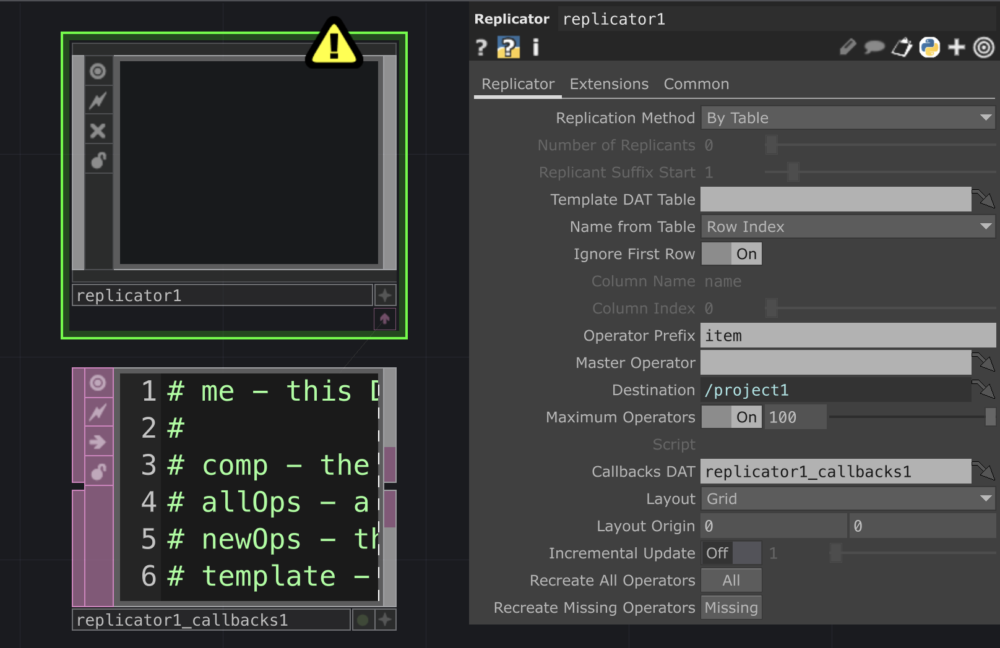
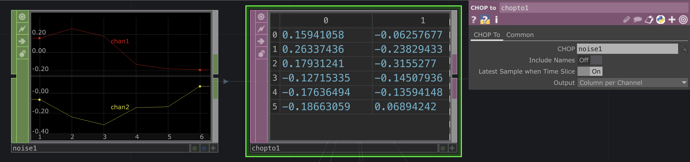
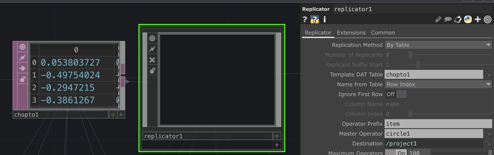
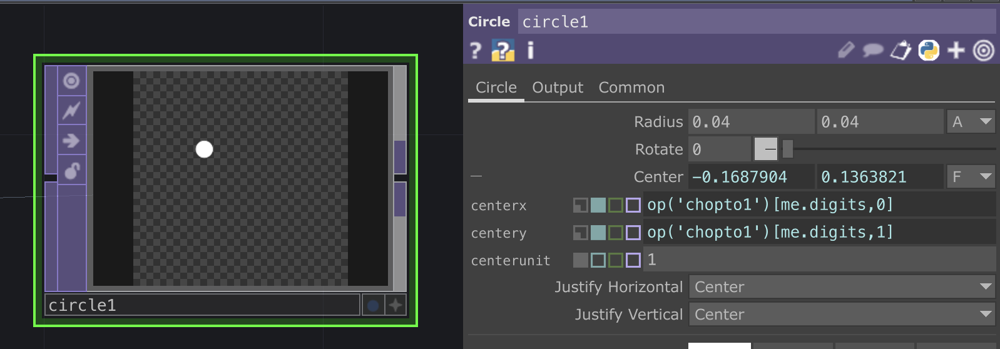
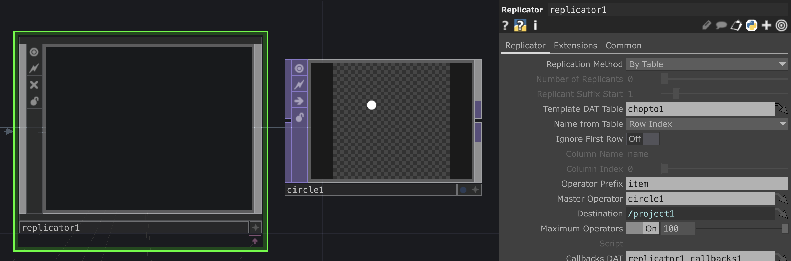
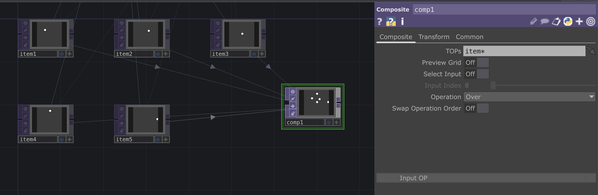

# Replicator COMP dans TouchDesigner

*Ou comment utiliser le Replicator COMP dans TouchDesigner pour cloner des composants à partir d'un tableau de données.*

- Le tuto [introduction à Touchdesigner](https://github.com/LucieMrc/IntroTD_FR)

*Network de base de Replicator*

# Le Replicator COMP

Le `Replicator` COMP va créer des objets "clones" à partir d'un objet "master" de base, en suivant une base de données. Il faut donc préciser au Replicator quel DAT est la base de données dans le paramètre "Template DAT Table", et quel node est le master dans le paramètre "Master Operator".

On peux choisir le nom des nodes "clones" avec le paramètre "Operator Prefix" ("item" par défaut).

# Le tableau de données

Il faut créer le tableau en sachant qu'on aura autant de clones que de ligne du tableau, et on peux avoir autant de colonnes que l'on veux.

Ici par exemple, j'ai crée un tableau avec un `Noise` CHOP puis un `CHOP to` DAT, où je récupère 6 lignes de 2 colonnes, qui me permettront de créer 6 clones avec une position X et Y.

Dans le `Replicator` COMP, je fais glisser le `CHOP to` DAT dans le paramètre "Template DAT Table".
Je choisis également "Row Index" dans le paramètre "Name From Table" (qui est normalement le paramètre par défaut) et je décoche "Ignore First Row" car ma première ligne sont des données.

# Le master

Le master node peut être un TOP, un SOP, etc, ou une `Base` COMP en fonction des besoins et de la complexité du network.

Pour qu'il permette de créer les clones à son image avec les données du tableau, il faut que ces données soient dans un ou plusieurs de ses paramètres.

Ici, je veux créer 6 cercles qui se déplacent en fonction des données du `Noise` CHOP. Je crée donc un `Circle` TOP.

Pour que le cercle se déplace, je dois changer les paramètres X et Y "Center" qui définissent la position du centre du cercle.

On sélectionne une des cellules du tableau du node `chopto1` en écrivant "op('chopto1')" pour sélectionner le node, puis "[me.digits, 0]" pour sélectionner la cellule du rang "me.digits" et colonne 0 pour le paramètre X (et "[me.digits, 0]" pour la colonne 1 pour le paramètre Y).

"me.digits" permet de récupérer l'index du clone afin de récuperer les données du rang. 

J'ai également réduit le diamètre du cercle avec le paramètre "Radius".

On fait glisser l'opérateur "circle1" sur le paramètre "Master Operator" dans le `Replicator` COMP.

# Composer les items crées

On a donc les 6 clones, nommés item1 à item6.
Afin de les composer et les afficher tous dans le même TOP, on crée un `Composite` TOP. Dans le paramètre "TOPs" du Composite, on écrit "item*" afin de sélectionner tous les nodes dont le nom commence par "item". 
L'astérisque * signifie "tout".

On peux faire la même chose avec un `Merge` SOP si les items sont des objets 3D.

